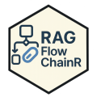

<!-- README.md is generated from README.Rmd. Please edit that file -->

# RAGFlowChainR <a href="https://knowusuboaky.github.io/RAGFlowChainR/"></a>

<!-- badges: start -->

[](https://opensource.org/licenses/MIT)
[](https://cran.r-project.org/package=RAGFlowChainR)
[](https://cranlogs.r-pkg.org/badges/grand-total/RAGFlowChainR)
[](https://app.codecov.io/gh/knowusuboaky/RAGFlowChainR?branch=main)
[](https://github.com/knowusuboaky/RAGFlowChainR/commits/main)
[](https://github.com/knowusuboaky/RAGFlowChainR/issues)
<!-- badges: end -->

## Overview

**RAGFlowChainR** is an R package that brings Retrieval-Augmented
Generation (RAG) capabilities to R, inspired by LangChain. It enables
intelligent retrieval of documents from a local vector store (DuckDB),
optional web search, and seamless integration with Large Language Models
(LLMs).

Features include:

- 📂 Ingest files and websites
- 🔍 Semantic search using vector embeddings
- 🧠 RAG chain execution with conversational memory and dynamic prompt
  construction
- 🔌 Plug-and-play with OpenAI, Ollama, Groq, and Anthropic

Python version: [RAGFlowChain
(PyPI)](https://pypi.org/project/RAGFlowChain/)  
GitHub (Python):
[RAGFlowChain](https://github.com/knowusuboaky/RAGFlowChain)


------------------------------------------------------------------------

## Installation

``` r
install.packages("RAGFlowChainR")
```

------------------------------------------------------------------------

## Development version

To get the latest features or bug fixes, you can install the development
version of `RAGFlowChainR` from GitHub:

``` r
# If needed
install.packages("remotes")

remotes::install_github("knowusuboaky/RAGFlowChainR")
```

See the full [function
reference](https://knowusuboaky.github.io/RAGFlowChainR/reference/) or the
[package website](https://knowusuboaky.github.io/RAGFlowChainR/) for more
details.

------------------------------------------------------------------------


## 🔐 Environment Setup

``` r
Sys.setenv(TAVILY_API_KEY    = "your-tavily-api-key")
Sys.setenv(OPENAI_API_KEY    = "your-openai-api-key")
Sys.setenv(GROQ_API_KEY      = "your-groq-api-key")
Sys.setenv(ANTHROPIC_API_KEY = "your-anthropic-api-key")
```

To persist across sessions, add these to your `~/.Renviron` file.

------------------------------------------------------------------------

## Usage

### 1. Data Ingestion

``` r
library(RAGFlowChainR)

local_files <- c("tests/testthat/test-data/sprint.pdf", 
                 "tests/testthat/test-data/introduction.pptx",
                 "tests/testthat/test-data/overview.txt")
website_urls <- c("https://www.r-project.org")
crawl_depth <- 1

response <- fetch_data(
  local_paths = local_files,
  website_urls = website_urls,
  crawl_depth = crawl_depth
)
```

``` r
response
#>                                source                                      title ...
#> 1                 documents/sprint.pdf                                       <NA> ...
#> 2          documents/introduction.pptx                                       <NA> ...
#> 3               documents/overview.txt                                       <NA> ...
#> 4            https://www.r-project.org R: The R Project for Statistical Computing ...
#> ...

cat(response$content[1])
#> Getting Started with Scrum\nCodeWithPraveen.com ...
```

------------------------------------------------------------------------

### 2. Vector Store & Semantic Search

``` r
con <- create_vectorstore("tests/testthat/test-data/my_vectors.duckdb", overwrite = TRUE)

docs <- data.frame(head(response))  # reuse from fetch_data()

insert_vectors(
  con = con,
  df = docs,
  embed_fun = embed_openai(),
  chunk_chars = 12000
)

build_vector_index(con, type = c("vss", "fts"))

response <- search_vectors(con, query_text = "Tell me about R?", top_k = 5)
```

``` r
response
#>    id page_content                                                dist
#> 1   5 [Home]\nDownload\nCRAN\nR Project...\n...                0.2183
#> 2   6 [Home]\nDownload\nCRAN\nR Project...\n...                0.2183
#> ...

cat(response$page_content[1])
#> [Home]\nDownload\nCRAN\nR Project\nAbout R\nLogo\n...
```

------------------------------------------------------------------------

### 3. RAG Chain Querying

``` r
rag_chain <- create_rag_chain(
  llm = call_llm,
  vector_database_directory = "tests/testthat/test-data/my_vectors.duckdb",
  method = "DuckDB",
  embedding_function = embed_openai(),
  use_web_search = FALSE
)

response <- rag_chain$invoke("Tell me about R")
```

``` r
response
#> $input
#> [1] "Tell me about R"
#>
#> $chat_history
#> [[1]] $role: "human", $content: "Tell me about R"
#> [[2]] $role: "assistant", $content: "R is a programming language..."
#>
#> $answer
#> [1] "R is a programming language and software environment commonly used for statistical computing and graphics..."

cat(response$answer)
#> R is a programming language and software environment commonly used for statistical computing and graphics...
```

------------------------------------------------------------------------

## LLM Support

``` r
call_llm(
  prompt = "Summarize the capital of France.",
  provider = "groq",
  model = "llama3-8b",
  temperature = 0.7,
  max_tokens = 200
)
```

------------------------------------------------------------------------

## 📦 Related Package: [`chatLLM`](https://cran.r-project.org/package=chatLLM)

The [`chatLLM`](https://github.com/knowusuboaky/chatLLM) package (now
available on CRAN 🎉) offers a modular interface for interacting with
LLM providers including **OpenAI**, **Groq**, **Anthropic**, **DeepSeek**, **DashScope**, and **GitHub Models**.

``` r
install.packages("chatLLM")
```

Features:

- 🔄 **Uniform API** across providers
- 🗣 **Multi‑message context** (system/user/assistant roles)
- 🔁 **Retries & backoff** with clear timeout handling
- 🔈 **Verbose control** (`verbose = TRUE/FALSE`)
- ⚙️ **Discover models** via `list_models()`
- 🏗 **Factory interface** for repeated calls
- 🌐 **Custom endpoint** override and advanced tuning
- 🔌 Native integration with `RAGFlowChainR`
- 🔐 `.Renviron`-based key management

------------------------------------------------------------------------

## License

MIT © [Kwadwo Daddy Nyame Owusu
Boakye](mailto:kwadwo.owusuboakye@outlook.com)
