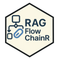

# RAGFlowChainR [](https://knowusuboaky.github.io/RAGFlowChainR/)

## Overview

`RAGFlowChainR` is an R package for Retrieval-Augmented Generation (RAG)
workflows with local retrieval backends (`DuckDB` and `VectrixDB`) plus
optional web search.

The README is intentionally short. Full backend workflows are documented
in vignettes.

------------------------------------------------------------------------

## Installation

``` r
install.packages("RAGFlowChainR")
```

------------------------------------------------------------------------

## Development version

``` r
install.packages("remotes")
remotes::install_github("knowusuboaky/RAGFlowChainR")
```

------------------------------------------------------------------------

## Backend Guides

- DuckDB backend article:
  <https://knowusuboaky.github.io/RAGFlowChainR/articles/duckdb-backend.html>
- VectrixDB backend article:
  <https://knowusuboaky.github.io/RAGFlowChainR/articles/vectrixdb-backend.html>
- Function reference:
  <https://knowusuboaky.github.io/RAGFlowChainR/reference/>

------------------------------------------------------------------------

## Quick Start

``` r
library(RAGFlowChainR)

rag <- create_rag_chain(
  llm = function(prompt) "mock answer",
  vector_database_directory = "my_vectors.duckdb",
  method = "DuckDB",
  use_web_search = FALSE
)

rag$invoke("What is RAG?")
rag$disconnect()
```

For complete ingestion, indexing, and backend-specific setup, use the
two backend vignettes above.

------------------------------------------------------------------------

## Environment Setup

``` r
Sys.setenv(TAVILY_API_KEY    = "your-tavily-api-key")
Sys.setenv(OPENAI_API_KEY    = "your-openai-api-key")
Sys.setenv(GROQ_API_KEY      = "your-groq-api-key")
Sys.setenv(ANTHROPIC_API_KEY = "your-anthropic-api-key")
```

------------------------------------------------------------------------

## License

MIT (c) [Kwadwo Daddy Nyame Owusu
Boakye](mailto:kwadwo.owusuboakye@outlook.com)
